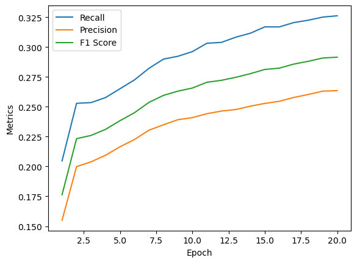
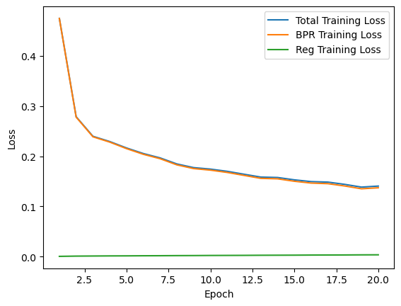
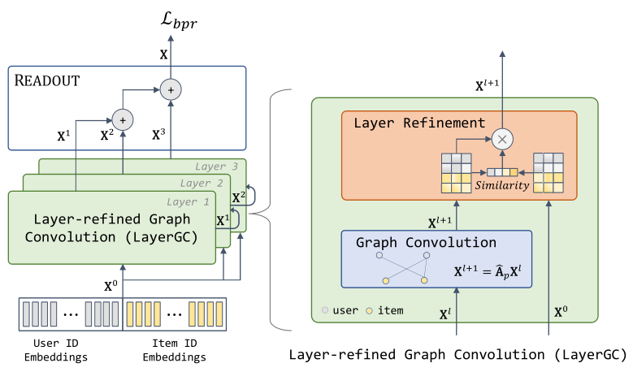

# Task explanation:

Create a recomendation system solution for MovieLens dataset.
The dataset is in the [directory](data/raw/).

# Models
Two models are presented in the directory:
One was trained in ipynb file (LightGCN)
LayerGCN was trained with [LayerGCN main](/models/IMRec/main.py).

The result for both models are well-described in [report](/reports/final_report.md):

- LightGCN:
Model weights are stored in [lightgcn.pth](/models/lightgcn.pth).
The [LightGCN notebook](/notebooks/light_gcn.ipynb) solution is based on [Recommender Systems with GNNs in PyG](https://medium.com/stanford-cs224w/recommender-systems-with-gnns-in-pyg-d8301178e377).

- LayerGCN:
Solution is based on [GitHub](https://github.com/enoche/ImRec/tree/master), the repo structure is was too complicated to split the solution into .py and .ipynb files, therefore I modified the repo to create plots and will make pull request. For now, the modified repo version is in the [folder](/models/IMREC/)
There is no well-performed model, therefore all pretrained models are [saved](/models/IMRec/saved/)

_0.1225.png)
_0.1225.png)