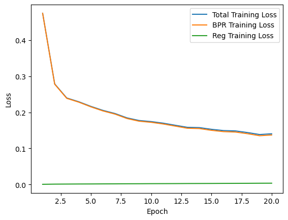

# Solution building process

Firstly, I've decided to use the following solution proposed on lab 11 [Recommender Systems with GNNs in PyG](https://medium.com/stanford-cs224w/recommender-systems-with-gnns-in-pyg-d8301178e377):

The authors compared two models: LightGCN and NGCF. 

Looking at the training process results I've noticed that the LightGCN model converges faster than NGCF. The authors also mentioned that LightGCN is more efficient than NGCF. But why?

## Difference between LightGCN and NGCF:
- NGCF uses weight matrices to transform the features of the nodes in each Layer, which are learned during training. LightGCN does not use these weights.
- NGCF uses a non-linear activation function (e.g. ReLU) after each layer. LightGCN does not use these activation functions.

So, LightGCN is more efficient than NGCF because it has less parameters to learn and less computations to perform. But since the LightGCN model does not use weights and activation functions, is there a risk of underfitting? I think so.

And I found a paper describing the problem of underfitting in LightGCN:
>Although the over-simplified GCN, LightGCN, is efficient in computation, it is easily stuck into a sub-optimal space with shallow layers, due to the over-smoothing problem. ([Layer-refined Graph Convolutional Networks for Recommendation
](https://arxiv.org/abs/2207.11088))

The authors explicitly shows based on their experiments results that LightGCN is prone to over-smoothing problem. So, I've decided to try to use a model, proposed in the article above, to solve this problem.


## LightGCN
As a start point I looked at the article where LightGCN model was proposed. The authors proposed a new model for recommendation systems based on graph convolutional networks. The model is called LightGCN.

The authours of LightGCN have providethe following summary of their [work](https://paperswithcode.com/paper/lightgcn-simplifying-and-powering-graph/review/):
```
• We empirically show that two common designs in GCN, feature transformation and nonlinear activation, have no positive effect on the effectiveness of collaborative filtering.
• We propose LightGCN, which largely simplifies the model design by including only the most essential components in GCN for recommendation.
• We empirically compare LightGCN with NGCF by following the same setting and demonstrate substantial improvements. In-depth analyses are provided towards the rationality of LightGCN from both technical and empirical perspectives.
```
 The model architecture is shown below:
### Model description

The model is based on Collaborative Filtering (CF) and Graph Convolutional Networks (GCN). The model is a stack of GCN layers. The authors proposed to use a simplified version of GCN, which does not use weights and activation functions. The model architecture is shown below:


### Model training results




In overall the results are good. The model converges fast and the metrics are good. But the model is overfitting. The validation loss is increasing after 5 epochs. The model was trained for 20 epochs, but the validation loss did not decrease. So, I've decided to stop training process after 20 epochs.


All the code for LightGCN model is located in the [LightGCN](/notebooks/light_gcn.ipynb) notebook. The model weights are saved in the [lightgcn.pth](/models/lightgcn.pth) file.

## LayerGCN

### Model description
The LayerGCN model is based on the LightGCN model. The main difference is that the LayerGCN model uses a stack of GCN layers with different receptive fields to capture the high-order connectivity of the graph. The authors also proposed a new layer aggregation strategy to avoid over-smoothing problem. The model architecture is shown below:


The overall structure of the model was hard to understand, therefore I found original implementation of the model on [GitHub](https://github.com/enoche/ImRec/tree/master). The trainer, dataloader and model evaluation are high coupled, so I just used the original implementation of the model.

### Model training results
The model was trained for 10 epochs. The training and validation loss are shown below:


It is easy to see, that the model is overfitting. The model was trained for 10 epochs, but the validation loss started to increase after 5 epochs. The model was trained for 5 epochs more, but the validation loss did not decrease. So, I've decided to stop training process after 10 epochs.
The model metrics are presented at the graph below:


The code for LayerGCN model is located in the [LayerGCN main](/models/IMRec/main.py) file. I didn't decide which model performed better, since the result of experiments are poor (presented in [plots](/models/IMREC/plots/)), so all the models weights are saved in the [saved](/models/IMRec/saved/) folder.

# Experiments with data:
```Disclaimer: all the experiments were performed on the LightGCN model.```

## Data preprocessing
### Negative items
I was curious about why the authors in [Recommender Systems with GNNs in PyG](https://medium.com/stanford-cs224w/recommender-systems-with-gnns-in-pyg-d8301178e377) as negative samples used only the items that were not rated by the user. I've decided to try to use all the items as negative samples. I've also decided to try to use the same number of positive and negative samples. 
The results foe LightGCN model are shown below:
With my data preprocessing:


With original data preprocessing:


The results are worse with my data preprocessing. So, I've decided to use the original data preprocessing.
The reason why it happened is that the model trained mostly on items ranked by an user, while the items not ranked by an user were used only as negative samples. So, the model was not able to learn the features of the items not ranked by an user.

### Timestamp filtering:
I've decided to try to filter the data by timestamp. I've filtered the data by timestamp, so that I simulated real situation: the model knows only data before the implementation and gets new video ranking data from users. The results are shown below:


### Feature extraction
After the last lecture about ethics in AI, I decided not to use features of an user, since it can lead to bias.
But the idea of usage of features of an item is good. To do so, it is crucial to have a layer in model, which will extract features of an item and combine the approach with Collaborative Filtering. 

The question about model architecture became too much complicated for me. I did not decide how to combine the features of an item with Collaborative Filtering. So, I've decided to use only Collaborative Filtering.
## Conclusion
The overall performance of LightGCN model is acceptable. The model converges fast and the metrics are good. In future work I want to try Item Based Collaborative Filtering approach, since the model will be able to learn more classical video recomendation technique (which all of us use in our daily life). If a friend liked a film of some genre, then he/she will probably like a film of the same genre as well. So, the model will be able to learn this feature and recommend a film of the same genre to a user.