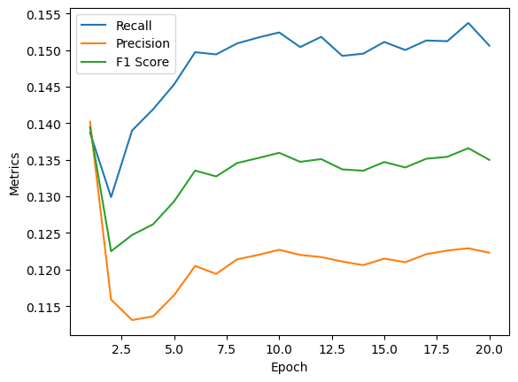

# Trying to modify data loader

I tried to change data_loader function, so istead of assuming that all non-positive ratings are negative, it would only take explicitly negative reviews as negative for the network:


```python
def data_loader(data, batch_size, n_usr, n_itm):
    def sample_neg(x):
        while True:
            neg_id = random.randint(0, n_itm - 1)
            if neg_id not in x:
                return neg_id

    indices = [x for x in range(n_usr)]

    # sample users to fit in batch size
    # if number of users is less than batch size, then sample with replacement
    if n_usr < batch_size:
        users = [random.choice(indices) for _ in range(batch_size)]
    else:
        users = random.sample(indices, batch_size)
    users.sort()
    users_df = pd.DataFrame(users, columns=["users"])

    positive_data = data[data["rating"] >= 3]
    df_split = (
        positive_data.groupby("user_id_idx")["item_id_idx"].apply(list).reset_index()
    )

    neg_data = data[data["rating"] < 3]
    df_split_neg = (
        neg_data.groupby("user_id_idx")["item_id_idx"].apply(list).reset_index()
    )

    # Merge the two dataframes based on user_id_idx
    merged_df = pd.merge(df_split, df_split_neg, on="user_id_idx", how="left")

    # Rename the columns
    merged_df.columns = ["user_id_idx", "pos item_id", "neg item_id"]

    mask = merged_df["neg item_id"].isnull()

    # count_nan = merged_df.isnull().sum()
    # print ('Count of NaN: ' + str(count_nan))

    merged_df.loc[mask, "neg item_id"] = merged_df[mask]["pos item_id"].apply(
        lambda x: [sample_neg(x)]
    )

    # count_nan = merged_df.isnull().sum()
    # print ('Count of NaN: ' + str(count_nan))

    merged_df = pd.merge(
        merged_df,
        users_df,
        how="right",
        left_on="user_id_idx",
        right_on="users",
    )

    pos_items = (
        merged_df["pos item_id"]
        .apply(lambda x: random.choice(x) if type(x) is list else random.choice([x]))
        .values
    )
    neg_items = (
        merged_df["neg item_id"]
        .apply(lambda x: random.choice(x) if type(x) is list else random.choice([x]))
        .values
    )

    display(merged_df.head(5))
    print(pos_items)
    print(neg_items)

    return (
        torch.LongTensor(list(users)).to(device),
        torch.LongTensor(list(pos_items)).to(device) + n_usr,
        torch.LongTensor(list(neg_items)).to(device) + n_usr,
    )


data_loader(test_df, 16, n_users, n_items)
```

In the end, the results were worse, so I thrown this idea away:


